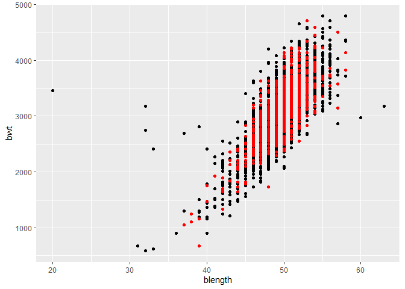

p8105_hw6_dtw2127
================
Dee Wang
03/12/2021

Load birth weight data and convert variables to factors where
appropriate.

``` r
birthweight = read_csv("./data/birthweight.csv") %>% 
  janitor::clean_names() %>% 
  mutate(
    babysex = as.factor(babysex),
    babysex = fct_recode(babysex, "male" = "1", "female" = "2"),
    frace = as.factor(frace),
    frace = fct_recode(frace, "white" = "1", "black" = "2", "asian" = "3", 
                       "puerto rican" = "4", "other" = "8"),
    malform = as.logical(malform),
    mrace = as.factor(mrace),
    mrace = fct_recode(mrace, "white" = "1", "black" = "2", "asian" = "3", 
                       "puerto rican" = "4"))
```

    ## Rows: 4342 Columns: 20

    ## -- Column specification --------------------------------------------------------
    ## Delimiter: ","
    ## dbl (20): babysex, bhead, blength, bwt, delwt, fincome, frace, gaweeks, malf...

    ## 
    ## i Use `spec()` to retrieve the full column specification for this data.
    ## i Specify the column types or set `show_col_types = FALSE` to quiet this message.

According to the literature, maternal race, maternal age, mother’s
weight, infant sex, parity, gestational weeks, and smoking all appear to
impact birth weight.

We’ll use a combination of the knowledge base on factors associated with
birth weight and a data-driven process to develop a model for birth
weight. Let’s start with a backwards selection process.

``` r
library(MASS)
```

    ## 
    ## Attaching package: 'MASS'

    ## The following object is masked from 'package:dplyr':
    ## 
    ##     select

``` r
full.model <- lm(bwt  ~., data = birthweight)

step.model <- stepAIC(full.model, direction = "backward", 
                      trace = FALSE)
summary(step.model)
```

    ## 
    ## Call:
    ## lm(formula = bwt ~ babysex + bhead + blength + delwt + fincome + 
    ##     gaweeks + mheight + mrace + parity + ppwt + smoken, data = birthweight)
    ## 
    ## Residuals:
    ##      Min       1Q   Median       3Q      Max 
    ## -1097.18  -185.52    -3.39   174.14  2353.44 
    ## 
    ## Coefficients:
    ##                     Estimate Std. Error t value Pr(>|t|)    
    ## (Intercept)       -6098.8219   137.5463 -44.340  < 2e-16 ***
    ## babysexfemale        28.5580     8.4549   3.378 0.000737 ***
    ## bhead               130.7770     3.4466  37.944  < 2e-16 ***
    ## blength              74.9471     2.0190  37.120  < 2e-16 ***
    ## delwt                 4.1067     0.3921  10.475  < 2e-16 ***
    ## fincome               0.3180     0.1747   1.820 0.068844 .  
    ## gaweeks              11.5925     1.4621   7.929 2.79e-15 ***
    ## mheight               6.5940     1.7849   3.694 0.000223 ***
    ## mraceblack         -138.7925     9.9071 -14.009  < 2e-16 ***
    ## mraceasian          -74.8868    42.3146  -1.770 0.076837 .  
    ## mracepuerto rican  -100.6781    19.3247  -5.210 1.98e-07 ***
    ## parity               96.3047    40.3362   2.388 0.017004 *  
    ## ppwt                 -2.6756     0.4274  -6.261 4.20e-10 ***
    ## smoken               -4.8434     0.5856  -8.271  < 2e-16 ***
    ## ---
    ## Signif. codes:  0 '***' 0.001 '**' 0.01 '*' 0.05 '.' 0.1 ' ' 1
    ## 
    ## Residual standard error: 272.3 on 4328 degrees of freedom
    ## Multiple R-squared:  0.7181, Adjusted R-squared:  0.7173 
    ## F-statistic: 848.1 on 13 and 4328 DF,  p-value: < 2.2e-16

``` r
fit = lm(bwt ~ babysex + bhead + blength + delwt + fincome + 
    gaweeks + mheight + mrace + parity + ppwt + smoken, data = birthweight)
```

The model generated by backwards selection includes many of the factors
that have been identified in the literature to be associated with
birthweight (race, infant sex, parity, gestational weeks, maternal
weight, and smoking). Additionally, baby’s head circumference and
length, and income, and mother’s height are also included in the model.

Let’s use the broom package to get a quick summary of the model and to
clean up the coefficient table.

``` r
fit %>% 
  broom::glance()
```

    ## # A tibble: 1 x 12
    ##   r.squared adj.r.squared sigma statistic p.value    df  logLik    AIC    BIC
    ##       <dbl>         <dbl> <dbl>     <dbl>   <dbl> <dbl>   <dbl>  <dbl>  <dbl>
    ## 1     0.718         0.717  272.      848.       0    13 -30500. 61029. 61125.
    ## # ... with 3 more variables: deviance <dbl>, df.residual <int>, nobs <int>

``` r
fit %>% broom::tidy() %>% 
  dplyr::select(term, estimate, p.value) %>% 
  knitr::kable(digits = 3)
```

| term              |  estimate | p.value |
|:------------------|----------:|--------:|
| (Intercept)       | -6098.822 |   0.000 |
| babysexfemale     |    28.558 |   0.001 |
| bhead             |   130.777 |   0.000 |
| blength           |    74.947 |   0.000 |
| delwt             |     4.107 |   0.000 |
| fincome           |     0.318 |   0.069 |
| gaweeks           |    11.592 |   0.000 |
| mheight           |     6.594 |   0.000 |
| mraceblack        |  -138.792 |   0.000 |
| mraceasian        |   -74.887 |   0.077 |
| mracepuerto rican |  -100.678 |   0.000 |
| parity            |    96.305 |   0.017 |
| ppwt              |    -2.676 |   0.000 |
| smoken            |    -4.843 |   0.000 |

we’ll make a plot of residuals against fitted values using
add_predictions and add_residuals.

``` r
birthweight %>%
  add_residuals(fit) %>% 
  add_predictions(fit) %>% 
  ggplot(aes(x = pred, y = resid)) +
  geom_point() + 
  labs(x = "predicted",
       y = "residuals",
       title = "model residuals plotted against fitted valued")
```

<!-- -->

Most of our observations are clustered around birthweights between 2500
and 4000. The residuals for birthweights in this range appear to be
randomly distributed. For lower birthweights, there appears to be a bit
of a trend of increasing residuals as predicted birthweight decreases,
but there also aren’t very many observations available for lower
birthweights.

Let’s compare our model to 1) a model using length at birth and
gestational age as predictors (we’ll call this the main effects model)
and 2) a model using head circumference, length, sex and all
interactions between these (we’ll call this the interactions model).

``` r
fit_main = lm(bwt ~ blength + gaweeks, data = birthweight)
fit_interaction = lm(bwt ~ bhead + blength + babysex + bhead:blength + bhead:babysex + blength:babysex + bhead:blength:babysex, data = birthweight)
```

We’ll use cross validation to compare our model to these two other
models.

The first thing we need to do is generate training and testing datasets.
We’ll generate an ID column to help with creation of these datasets.
We’ll use 80% of the data for our training dataset and 20% for our
testing dataset.

``` r
birthweight = birthweight %>%
  mutate(ID = row_number())

train_df = sample_n(birthweight, 0.8*nrow(birthweight)) #80% data for training df
test_df = anti_join(birthweight, train_df, by = "ID")
```

Let’s compare the distributions of the training and testing datasets
using bwt and blength.

``` r
ggplot(train_df, aes(x = blength, y = bwt)) + 
  geom_point() + 
  geom_point(data = test_df, colour = "red")
```

<!-- -->

The test and training data distributions are similar.

We’ll fit three models to the training data.

``` r
my_model = lm(bwt ~ babysex + bhead + blength + delwt + fincome + 
    gaweeks + mheight + mrace + parity + ppwt + smoken, data = train_df)

model_main_effects = lm(bwt ~ blength + gaweeks, data = train_df)

model_interactions = lm(bwt ~ bhead + blength + babysex + bhead:blength + bhead:babysex + blength:babysex + bhead:blength:babysex, data = train_df)
```

Next let’s compute root mean squared errors (RMSEs).

``` r
rmse(my_model, test_df)
```

    ## [1] 264.8542

``` r
rmse(model_main_effects, test_df)
```

    ## [1] 318.5849

``` r
rmse(model_interactions, test_df)
```

    ## [1] 276.7879

Based off the RMSEs, it suggests that my_model works the best.

We’ll iterate this process so that we can be more certain which model is
best. Let’s create 100 training and testing datasets. We’ll then fit
models and obtain RMSEs.

``` r
cv_df = 
  crossv_mc(birthweight, 100) #create 100 training sets. default is 80/20 training/test split. 
cv_df = 
  cv_df %>% 
  mutate(
    my_model  = map(.x = train, ~lm(bwt ~ babysex + bhead + blength + delwt + fincome + 
    gaweeks + mheight + mrace + parity + ppwt + smoken, data = .x))
    ) %>% 
  mutate(
    rmse_my_model = map2_dbl(my_model, test, ~rmse(model = .x, data = .y))
    )
cv_df = 
  cv_df %>% 
  mutate(
    model_main_effects = map(.x = train, ~lm(bwt ~ blength + gaweeks, data = .x))
    ) %>% 
  mutate(
    rmse_model_main_effects = map2_dbl(model_main_effects, test, ~rmse(model = .x, data = .y))
    )
cv_df = 
  cv_df %>% 
  mutate(
    model_interactions = map(.x = train, ~lm(bwt ~ bhead + blength + babysex + bhead:blength + bhead:babysex + blength:babysex + bhead:blength:babysex, data = .x))
    ) %>% 
  mutate(
    rmse_model_interactions = map2_dbl(model_interactions, test, ~rmse(model = .x, data = .y))
    )
```

Let’s plot the prediction error distributions for each of the three
models.

``` r
cv_df %>% 
  dplyr::select(starts_with("rmse")) %>% 
  pivot_longer(
    everything(),
    names_to = "model", 
    values_to = "rmse",
    names_prefix = "rmse_") %>% 
  mutate(model = fct_inorder(model)) %>% 
  ggplot(aes(x = model, y = rmse)) + geom_violin()
```

<!-- -->

Based on these plots, it appears that my_model is the best (as it has
the smallest rmse values), followed by the model with interaction terms.
The main effects only model has the highest rmse values and widest
distribution.

## Problem 2

First we download the 2017 Central Park weather data.

``` r
weather_df = 
  rnoaa::meteo_pull_monitors(
    c("USW00094728"),
    var = c("PRCP", "TMIN", "TMAX"), 
    date_min = "2017-01-01",
    date_max = "2017-12-31") %>%
  mutate(
    name = recode(id, USW00094728 = "CentralPark_NY"),
    tmin = tmin / 10,
    tmax = tmax / 10) %>%
  dplyr::select(name, id, everything())
```

    ## Registered S3 method overwritten by 'hoardr':
    ##   method           from
    ##   print.cache_info httr

    ## using cached file: C:\Users\Dee\AppData\Local/Cache/R/noaa_ghcnd/USW00094728.dly

    ## date created (size, mb): 2021-10-05 10:32:13 (7.617)

    ## file min/max dates: 1869-01-01 / 2021-10-31

We will be focusing on a simple linear regression with tmax as the
response variable and tmin as the predictor.

``` r
model = lm(tmax~tmin, data = weather_df) %>% 
  broom::glance()
```

We are interested in the distribution of r2hat and log(B0hatB1hat).
We’ll use 5000 bootstrap samples to generate estimates for r2hat and
log(B0hatB1hat). Let’s start with r2hat.

``` r
boot_straps_r2 = 
  weather_df %>% 
  modelr::bootstrap(n = 5000) %>% 
  mutate(
    models = map(strap, ~lm(tmax ~ tmin, data = .x) ),
    results = map(models, broom::glance)) %>% 
  dplyr::select(-strap, -models) %>% 
  unnest(results) %>% 
  summarize(ci_lower = quantile(r.squared, 0.025),
            ci_upper = quantile(r.squared, 0.975)) 

print(boot_straps_r2)
```

    ## # A tibble: 1 x 2
    ##   ci_lower ci_upper
    ##      <dbl>    <dbl>
    ## 1    0.894    0.927

The 95% confidence interval for r2hat is (0.89, 0.93).

Let’s plot the distribution of r2hat.

``` r
  weather_df %>% 
  modelr::bootstrap(n = 5000) %>% 
  mutate(
    models = map(strap, ~lm(tmax ~ tmin, data = .x) ),
    results = map(models, broom::glance)) %>% 
  dplyr::select(-strap, -models) %>% 
  unnest(results) %>% 
  ggplot(aes(x = r.squared)) + 
  geom_density() + 
  labs(x = "r squared estimates",
       title = "distribution of bootstrapped r squared estimates")
```

<!-- -->

The distribution for r squared estimates is approximately normal, but is
left skewed which may be related to the frequency of outliers getting
included in the bootstrap samples.

Let’s generate bootstrap estimates for log(B0hat\*B1hat).

``` r
boot_straps_logb0b1 = 
  weather_df %>% 
  modelr::bootstrap(n = 5000) %>% 
  mutate(
    models = map(strap, ~lm(tmax ~ tmin, data = .x)),
    results = map(models, broom::tidy)) %>% 
  dplyr::select(-strap, -models) %>% 
  unnest(results) %>% 
  mutate(log_estimate = log(estimate)) %>% 
  group_by(.id) %>% 
  summarize(logb0b1 = sum(log_estimate)) %>% 
  summarize(ci_lower = quantile(logb0b1, 0.025),
            ci_upper = quantile(logb0b1, 0.975))
print(boot_straps_logb0b1)
```

    ## # A tibble: 1 x 2
    ##   ci_lower ci_upper
    ##      <dbl>    <dbl>
    ## 1     1.97     2.06

The 95% confidence interval for log(B0hat\*B1hat) is (1.96, 2.06).

Let’s check the distribution of the log(B0\*B1) estimates.

``` r
  weather_df %>% 
  modelr::bootstrap(n = 5000) %>% 
  mutate(
    models = map(strap, ~lm(tmax ~ tmin, data = .x)),
    results = map(models, broom::tidy)) %>% 
  dplyr::select(-strap, -models) %>% 
  unnest(results) %>% 
  mutate(log_estimate = log(estimate)) %>% 
  group_by(.id) %>% 
  summarize(logb0b1 = sum(log_estimate)) %>% 
  ggplot(aes(x = logb0b1)) + 
  geom_density() + 
  labs(x = "logB0B1 estimates",
       title = "distribution of bootstrapped log(B0B1) estimates")
```

<!-- -->

The distribution for for log(B0hat\*B1hat) is similar to the r2hat
distribution. It is approximately normal, but also a bit left skewed
which again, may be related to the frequency of outliers getting
included in the bootstrap samples.
